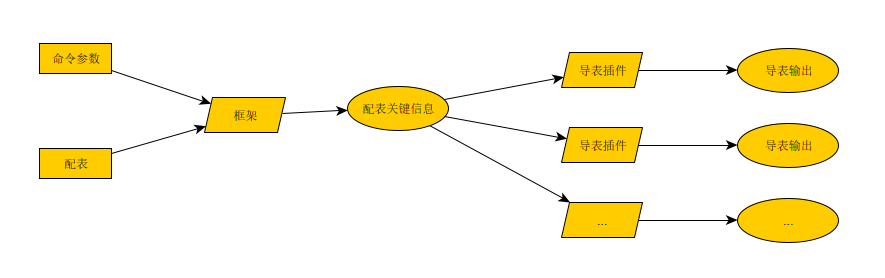

## 导表插件开发指南

### 工作原理

导表工具工作流程如下图:



如图所示, 导表框架部分主要负责解析配表关键信息, 并输出给导表插件使用, 并由导表插件最终负责输出所需信息（例如生成代码或者json文件等）。

### 开发流程

#### 创建插件项目

导表插件是一个普通的node_module, 需要满足:

- package.json 中, `main`字段的值必须指向一个`导出插件列表 (IPlugin[]) `的js文件。

#### 安装依赖

开发导表插件通常需要依赖一下公共依赖库

```shell
npm i -g export-table-lib
```

#### 处理导表信息

- 创建插件代码
  - 更多开发细节可以参考: [meec插件项目源码](https://gitee.com/windyuuy/export-table-pulgin-meec/tree/master)

```typescript
///file: ./dist/index.js
// 最简单的方式是创建一个类继承 PluginBase, 其中 PluginBase已经实现了默认的IPlugin接口
export class ExportDialogPlugin extends PluginBase {
    // 插件名, 尽量保持唯一
	name = "meec"
    // 插件标签列表, 至少需要指定一个tag, 能体现插件的工作内容
	tags: string[] = ["dialog"]

	handleSheet(paras: HandleSheetParams) {
		// 单独处理每张sheet的信息
        let content = 处理sheet信息(paras)
		if (content != null) {
			fs.outputFileSync(para.outPath, content, "utf-8")
		}
		return content
	}

	handleBatch(paras: HandleBatchParams): void {
		// 处理所有sheet
	}
}

// 最后需要导出插件对象
export const ExportPlugins = [
	new ExportDialogPlugin(),
]
```

- 在实现完插件代码后, 需要在 package.json 中同步对应的配置项

```json
{
  "name": "export-table-pulgin-dialog",
  "version": "1.0.5",
  "description": "export dialog for meec",
    // main字段的设置很重要, 需要指向上面创建的index.js !!!
  "main": "./dist/index.js",
  "author": "windyuuy",
  ...
}

```

#### 自测

- 开发完插件后, 需要在项目中创建test目录, 并放置测试配表供自测使用。

- 本地测试命令

  ```shell
  quicktable export $from $to --tags meec:dialog --libs $插件项目所在路径(父路径, 不是插件项目路径)
  
  ```

  

#### 发布版本和使用

- 测试通过后, 提交项目, 并使用 npm publish 发布版本

- 使用时, 使用npm安装插件, 并执行导表命令, 如:

  ```shell
  // 安装插件
  npm i -g windy-quicktable export-table-pulgin-dialog
  // 导表
  quicktable export $from $to --tags meec:dialog
  ```

  